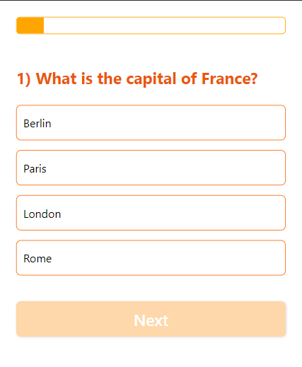
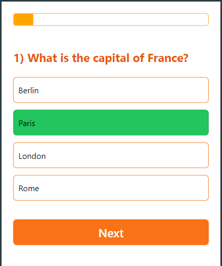
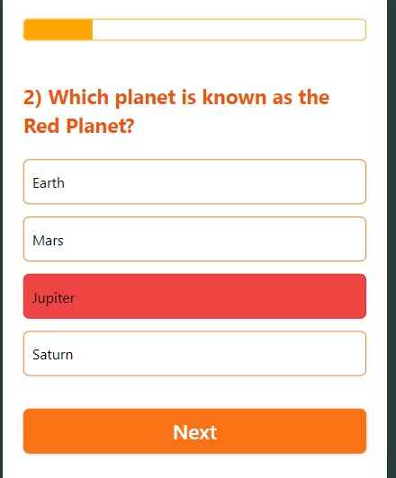

# Quizzer

## A Basic Quiz App Built with React Native Expo

Welcome to **Quizzer**, a simple quiz app built using **React Native Expo**. This app allows users to take a 10-question quiz, with the ability to navigate through questions only after selecting an option. The app features a progress bar at the top to track the user's progress, and a submit button on the last question to view the final score.

## Features

- **10-question quiz** with option selection
- **Progress bar** to track user progress
- **Correct or incorrect selection styling**
- **Submit button** on the last question to view final score
- **Result page** displaying the user's score

## ScreenShots

### Homepage


### Questions



### Correct Selection



### Incorrect Selection



### Result


## Getting Started

### Installation

To install and run the Quizzer app, follow these steps:

1. **Clone the repository:**

   ```bash
   git clone https://github.com/AdityaNair07/Quizzer.git


2. **Install dependencies:**

   ```bash
   npm install
   ```

3. **Start the app:**

   ```bash
    npx expo start
   ```

## Running the App

After starting the app, you'll have options to open the app in a:

In the output, you'll find options to open the app in a

- [development build](https://docs.expo.dev/develop/development-builds/introduction/)
- [Android emulator](https://docs.expo.dev/workflow/android-studio-emulator/)
- [iOS simulator](https://docs.expo.dev/workflow/ios-simulator/)
- [Expo Go](https://expo.dev/go), a limited sandbox for trying out app development with Expo

Choose your preferred option to run the app.

Development:

The app uses file-based routing, and you can start developing by editing the files inside the app directory.

You can start developing by editing the files inside the **app** directory. This project uses [file-based routing](https://docs.expo.dev/router/introduction).

## Get a fresh project

When you're ready, run:

```bash
npm run reset-project
```

This command will move the starter code to the **app-example** directory and create a blank **app** directory where you can start developing.

## Learn more

To learn more about developing your project with Expo, look at the following resources:

- [Expo documentation](https://docs.expo.dev/): Learn fundamentals, or go into advanced topics with our [guides](https://docs.expo.dev/guides).
- [Learn Expo tutorial](https://docs.expo.dev/tutorial/introduction/): Follow a step-by-step tutorial where you'll create a project that runs on Android, iOS, and the web.

## Join the community

Join our community of developers creating universal apps.

- [Expo on GitHub](https://github.com/expo/expo): View our open source platform and contribute.
- [Discord community](https://chat.expo.dev): Chat with Expo users and ask questions.
